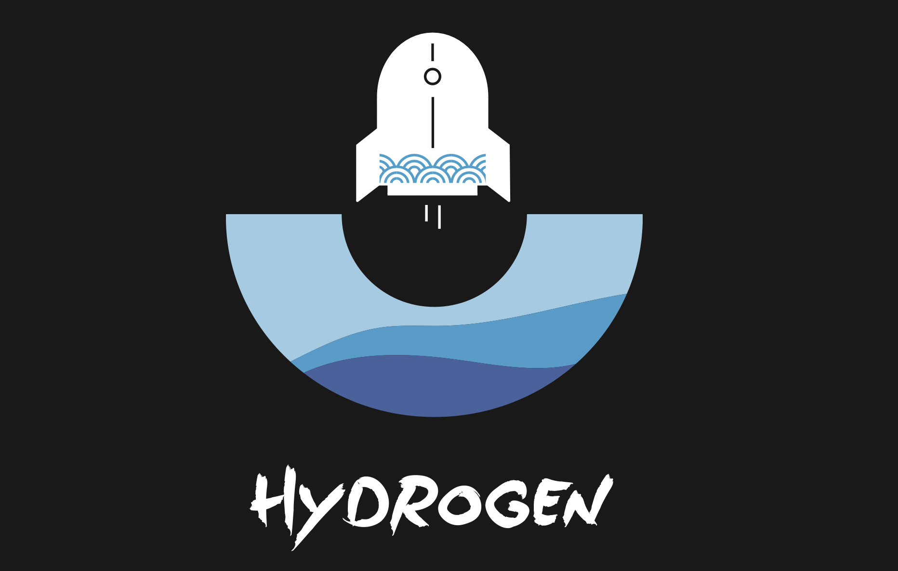

# 招聘

## 我们是谁

我们是伴鱼技术中台成立半年后，建立的「系统平台」团队，主要负责公司级别工程效率、可观测性、部分业务通用型相关系统的设计、研发、运维和推广，「为公司研发及客服、质检等内部团队降本增效」是我们团队的使命所在。

我们更愿意将「系统平台」理解为「系统性解决问题的平台」，在团队成立至今的一年半时间内，为了系统性地解决问题，我们做了一些有趣的工程实践：

* [发布系统](https://xie.infoq.cn/article/598063f249b1a07c20d38cb5f)：统一管理服务端、前端、Android 和 iOS 项目的发布流程，将原本分散而粗暴的项目发布流程收口。降低项目研发的培训、上手、理解、使用成本，为各端基础架构团队维护基础库版本、测试团队自动化测试，为工程师快速定位问题提供准确、完整的发布事件数据。
* [调用链追踪](https://www.infoq.cn/article/pkY4SZfhBviFXrcRIQCr)：公司微服务数量逐渐增加后，我们通过引入 Jaeger 到微服务框架，提供一键迁移脚本，先解决调用链追踪从无到有的问题。但 Jaeger 的基于限流、概率的采样策略天生会造成大小流量接口采集不均衡，导致研发使用时「想查的没采到，采到的没啥用」的情况。经过调研，我们通过结合 OpenTelemetry-Collector 项目，引入尾部采样，最终做到「只采集研发感兴趣的调用链」。
* 可观测性平台：调用链、监控指标、日志是微服务可观测性的基础。在完成调用链追踪基础设施建设的同时，我们和运维一起基于 Prometheus 和 VictoriaMetrics 构建了高可用、可扩展、中心化、多采样率的监控基础设施，后续我们将进一步优化现有的 ELK 日志分析套件，降低存储量的同时，提供日志过滤、分析的能力。基于调用链、监控指标、日志，我们还构建了可观测性平台，让研发工程师们能够从报警找到调用链、从调用链找到服务指标、从异常指标找到异常日志，拥有微服务架构下根因分析的趁手工具。微服务化过程中，不仅仅服务的运行时被拆分，服务的代码仓库也被拆分，因此全局代码检索也是可观测性的一部分，我们也在这个方向开始探索。
* 业务流程管理：在即将启动或接手公司内部的 OKR、人才数字档案、质检判责以及各种审批流相关系统前，我们及时发现了它们之间的共性：流程定义和流转。于是我们经过调研，决定基于 BPMN 2.0 标准搭建了 BPM 系统，大大减轻了后续类似后台系统的开发、接入成本。

最近，我们团队开始接触一些业务通用型系统开发，如智能质检、MCN 管理、商城、模拟考试，它们都还在早期阶段。这些项目对我们来说是全新的挑战。我们相信「多一份经验，多一层理解」，期待我们团队能借助「中台」与「业务」系统开发的双重经验，获得对工程实践、系统设计、团队合作的更全面的理解。

## 团队氛围

整个技术中台的团队文化可以移步伴鱼技术博客详细了解。「系统平台」团队是由一帮 90-99 年间出生，血气方刚的小伙子们 : ) 组成。我们希望每个问题都能被「系统性」地解决，因此每个大型项目都会经历 "**调研 → 概念验证 (PoC) → 方案设计 → 团队内部评审 → 部门评审 → 开发上线 → 推广、收集反馈、输出技术分享、博客 → 新的调研**" 的过程。在过去的一年半时间，我们组织了超过 40 次跨团队技术分享，也设计、推动了技术中台发布两版文化衫：

## 加入我们

我们对即将加入的你，有这样的期待：

* 拥有扎实的计算机基础知识及系统的学习能力和学习习惯

* 熟练使用任意一门通用语言开发后端服务 (公司内部使用 Go 语言开发)

* 拥有良好的工程习惯和系统设计品味，有公司级中、大型系统设计、开发和运维经验

* 有强大的自驱力，强烈的责任心和团队合作意识

如果你有以下经历：

* 有维护和更新个人博客的习惯

* 有深入研究过任意计算机工程或理论领域话题

* 深入学习过知名公开课或贡献开源项目

对我们来说是更大的惊喜。

> 💡如何加入：欢迎发送简历至 zhenghe3119@ipalfish.com，如果对公司其它岗位、方向、团队有兴趣也欢迎联系。

